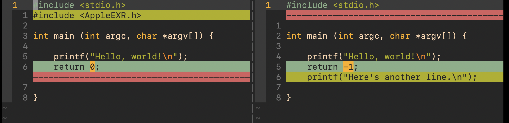

# vim-diffsave

When you try to exit vim, vim prompts you about unsaved changes. However, you
aren't sure whether to save, because you lost track of all the places you
edited. vim-diffsave is a lightweight vim plugin that allows you to view where
a file has changed since last disk save.

## Installation

Use your favorite vim plugin manager. For example, if you use [vim-plug][VP],
put this in your `vimrc`:

[VP]:
https://github.com/junegunn/vim-plug

```vim
Plug 'cterdam/vim-diffsave'
```

## Usage

The plugin creates the command `<Plug>ToggleDiffSave`. In your `vimrc`, map
this command to a key sequence:

```vim
nmap <Leader>w <Plug>ToggleDiffSave<CR>
```

Now, in normal mode, type `<Leader>w` to toggle a diffsave window comparing
the active file's content with its last save. By default, the Leader key is
`\`, the key above `Enter` on most keyboards.

If the active file is unmodifiable, nothing will be triggered.

Note that there can be only one diffsave window per tab. If one exists in the
current tab, calling the command will only close it before opening new ones.

## Example

Assume you have written such a file to disk:


After this, make some more edits **without saving**:


Now you can't exit vim by `:q` without resolving unsaved changes. To look at
where the changes really occurred, type your mapped key sequence (`<Leader>w`)
to get a diff window showing all unsaved changes:



All changes are color-coded. If the file is really long, unchanged parts will
be folded into temporary folds, without impacting your `fold` settings. This
is functionality provided by `vimdiff`.

Type the key sequence again, and the diff window will be collapsed. You will
be looking at your edited (unsaved) file again.

Note that after saving changes with `:w`, the diff window will show nothing,
as the file would be the same as its disk save.
