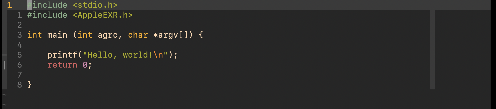
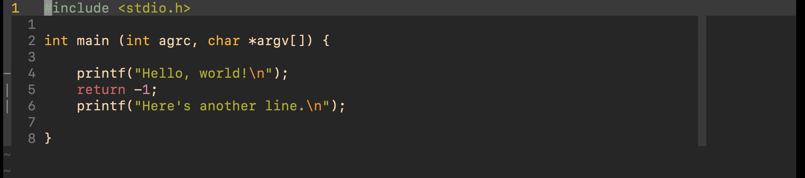
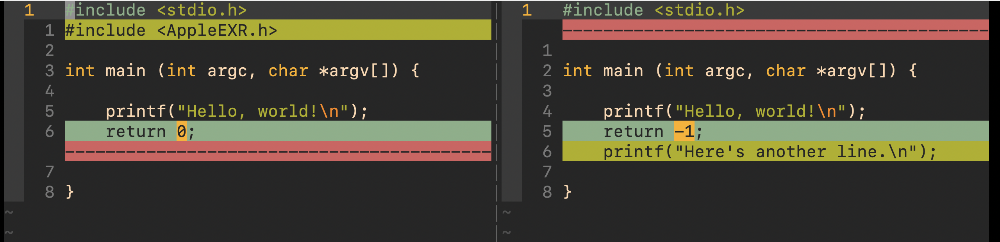

# vim-diffsave

When you try to exit vim, vim prompts you about unsaved changes. However, you
aren't sure whether to save, because you lost track of all the places you
edited. vim-diffsave is a lightweight vim plugin that allows you to view where a
file has changed since last disk save.

## Installation

Use your favorite vim plugin manager. For example, if you are using
[vim-plug][1], put this in your `vimrc`:

[1]:
https://github.com/junegunn/vim-plug

```vim
Plug 'cterdam/vim-diffsave'
```

## Usage

The plugin creates the command `<Plug>ToggleDiffSave`.

In your `vimrc`, map this command to a hotkey:

```vim
nmap <Leader>w <Plug>ToggleDiffSave<CR>
```

Now, in normal mode you can toggle the diffsave view with `<Leader>w`.  
Note that there can be only one diffsave window per tab.

## Example

Assume you have written such a file to disk:



After this, you made some more edits without saving:



And now you want to exit vim by `:q`, but vim asks you if you want to write
unsaved changes. To look at where the changes really occurred, you type your
mapped key sequence (`<Leader>w`) to get a diff window showing all unsaved
changes:



All unsaved changes are color-coded. If the file is really long, unchanged parts
will be folded into temporary folds, without impacting your `fold` settings.
This is functionality provided by `vimdiff`.

Type your key sequence again, and the diff window will be collapsed. You will be
looking at your edited (unsaved) file again.
